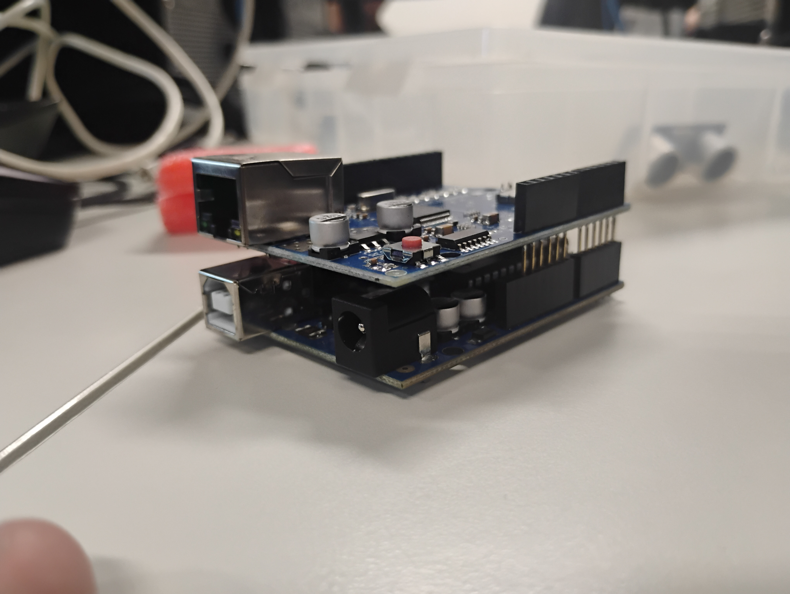
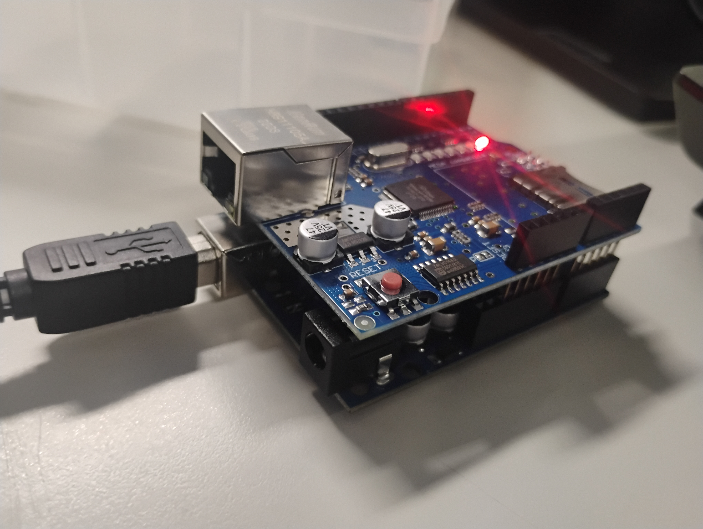
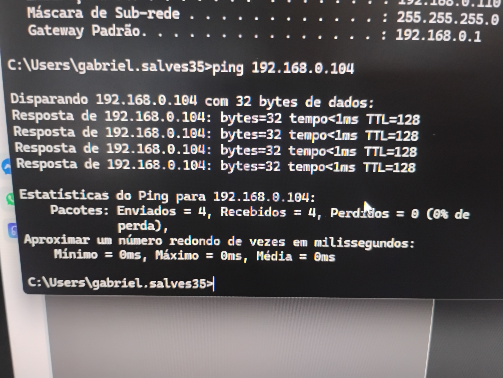
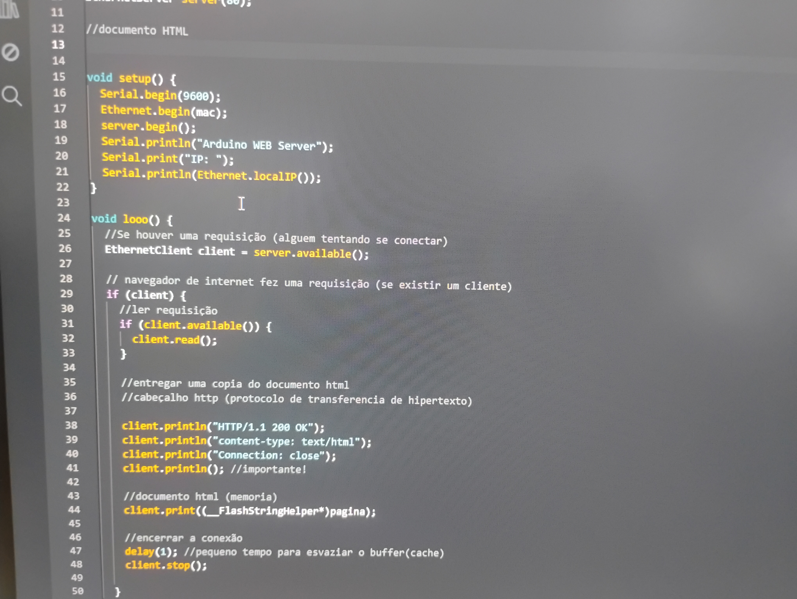

# Projeto IoT com Arduino (Documentação parcialmente completa)

---

Participação:
- Ruan
- Gabriel
- João

---

## 1. Objetivo (Parcial)

Dar início ao desenvolvimento de um projeto usando **Arduino** e **Internet das Coisas (IoT)**.

Nesta fase serão feitas as seguintes atividades:

- Identificar e preparar os **componentes do projeto**
- Realizar a **ligação física da placa Arduino e dos módulos**
- Fazer a **configuração da rede** (LAN, DHCP e reserva de IP)
- Realizar **testes de comunicação entre o computador e o Arduino**
- Criar os **primeiros códigos utilizando comunicação Serial e Ethernet**

---

## 2. Equipamento

- Ethernet Shield W5100 – módulo para conectar o Arduino à rede via cabo
- Placas e Módulos
Arduino UNO R3 – placa principal do projeto (microcontrolador ATmega328P)

 

 ## Cabos e Conexões

- **Cabo USB Tipo B** – utilizado para programar e conectar o Arduino ao computador  
- **Cabo de rede (Ethernet)** – usado para conectar o Arduino ou computador à rede  
- **Roteador Wi-Fi** – equipamento com portas **LAN e WAN** para fornecer acesso à rede e internet

---

## 3. Programação Inicial (codigos iniciais)

- loop() – executa repetidamente
- setup() – executa 1 vez ao iniciar

```

// Gerar um endereço físico (MAC ADDRES) para esta placa
// htpp://ssl.crox.net/arduinomac
byte mac[6] = { 0x90, 0xA2, 0xDA, 0xA0, 0x17, 0x8A };

// Instalar (criar) um servidor
EthernetServer server(80);  //80 é a porta http

void setup() {
  Serial.begin(9600);
  // As linhas abaixo iniciam o servidor e atribui automaticamente um IP para o Arduino
  Ethernet.begin(mac);  //atriui o endereço MAC ao shield Ethernet
  server.begin();       //inicia o servidor

  // As linhas abaixo exibe o IP da placa Arduino
  Serial.println("Arduino Ethernet Shield:");
  Serial.print("IP: ");
  Serial.println(Ethernet.localIP());  //identifica o IP
  Serial.print("Máscara: ");
  Serial.print(Ethernet.subnetMask());  //identifica a máscara de rede
  Serial.print("Gateway: ");
  Serial.print(Ethernet.gatewayIP());  //identifica o gateway
  Serial.print("DNS: ");
  Serial.print(Ethernet.dnsServerIP());  //identifica o DNS
}

void loop() {
}

```

---

## 4. Primeiro teste

Teste no Computador Arduino IDE

- IP Arduino
- Máscara
- Gateway

 


 teste na Visão do Arduino

 

 ---
 
## 5. Reserva de IP no Roteador

Nesta parte, no painel de configuração do **roteador**, foi criada uma **reserva de IP no DHCP**, garantindo que o **Arduino sempre receba o mesmo endereço IP** na rede.

Em seguida, no **Prompt de Comando (CMD) do Windows**, foi utilizado o comando:

IP Arduino: 192.168.0.102

 

 Ping do Arduino no Prompt de Comando

  

  ---

## 6. Desenvolvimento HTML (VS CODE)

- Ativação do **salvamento automático** no editor de código  
- Instalação da extensão **Live Server**  
- Criação do arquivo **index.html** para iniciar a página do projeto


Código inicial:

```

<!DOCTYPE html>
<html lang="pt-br">
<head>
    <meta charset="UTF-8">
    <meta name="viewport" 
    content="width=device-width, initial-scale=1.0">
    <title>Arduino WEB Server</title>
    <style>
     body {
        font-family: sans-serif;
        text-align: center
     }   
    </style>
</head>
<body>
    <h1>Hello Arduino</h1>
</body>
</html>

```

---

## 7. Programando o Arduino Web Server




- **Ethernet.begin(mac);** → Obtém um **endereço IP automaticamente pelo DHCP** da rede.

- **server.begin();** → Inicia um **servidor web** no Arduino utilizando a **porta 80**.

- **Ethernet.localIP();** → Exibe o **endereço IP atual do Arduino** na rede.


  ---

## 8. teste no Arduino IDE

```
/**
 Arduino IoT
 @author Ruan Anderson

*/

#include <SPI.h>
#include <Ethernet.h>
byte mac[6] = { 0x90, 0xA2, 0xDA, 0xA0, 0x17, 0x8A };
EthernetServer server(80);

#define led 8

const char pagina[] PROGMEM = R"HTML(
<!DOCTYPE html>
<html lang="pt-br">
<head>
    <meta charset="UTF-8">
    <meta name="viewport" content="width=device-width, initial-scale=1.0">
    <title>Arduino IoT</title>
    <style>
        body {
            font-family: sans-serif;
            text-align: center;
        }

        a {
            text-decoration: none;
            font-weight: bold;
            padding: 12px;
            width: 100px;
            display: inline-block;
            color: #ffffff;
        

          

        }

        .on {
            background-color: #3498db;
        }

        .off{
            background-color: #718c8d;
        }
    </style>
<body>
  <h1>Arduino IoT</h1>
    <p>Exemplo 1: Controle
     dispositivo</p>
    <h2> Controle do LED</h2>
   <a href="/?led-on" class="on">ON</a>
   <a href="/?led-off" class="off">OFF</a>

</body>

</html1>
)HTML";

void setup() {
  pinMode(led, OUTPUT);
  Serial.begin(9600);
  Ethernet.begin(mac);
  server.begin();
  Serial.println("Arduino IoT");
  Serial.print("IP: ");
  Serial.println(Ethernet.localIP());
}

void loop() {

  //Se houver uma requisição (alguem tentando se conectar)
  EthernetClient client = server.available();

  // navegador de internet fez uma requisição (se existir um cliente)
  if (client) {

    //ler requisição e armazenar o valor na string
    String request = "";  //variavel usada para armazenar uma string
                         
     //enquanto houver caracteres para recebimento
    while (client.available()) {
      char c = client.read();  //ler o caractere
      request += c;            //soma e atribui montando a frase
    }
  }
  // Execução dos comandos recebidos
  //se receber o comando /?led-on

  if (request.indexOf("GET /?led-on") >= 0) {
    digitalWrite(led, HIGH);  //acender o led
  }


  if (request.indexOf("GET /?led-off") >= 0) {
    digitalWrite(led, LOW);  //apagar o led
  }


  //entregar uma copia do documento html
  //cabeçalho http (protocolo de transferencia de hipertexto)

  client.println("HTTP/1.1 200 OK");
  client.println("content-type: text/html");
  client.println("Connection: close");
  client.println();  //importante!

  //documento html (memoria)
  client.print((__FlashStringHelper*)pagina);

  //encerrar a conexão
  delay(1);  //pequeno tempo para esvaziar o buffer(cache)
  client.stop();
}

```

  ---

  ## . Conclusão Parcial

Neste dia, o grupo realizou as seguintes atividades:

- Preparação dos componentes do projeto  
- Programação inicial do Arduino  
- Teste da comunicação **Serial**  
- Montagem da **rede local** utilizando um roteador  
- Conexão do **Arduino à rede via cabo Ethernet**  
- Verificação das configurações de rede (**IP, máscara, gateway e DNS**)  
- Configuração da **reserva de IP no DHCP**  
- Teste de conectividade usando o comando **ping**
